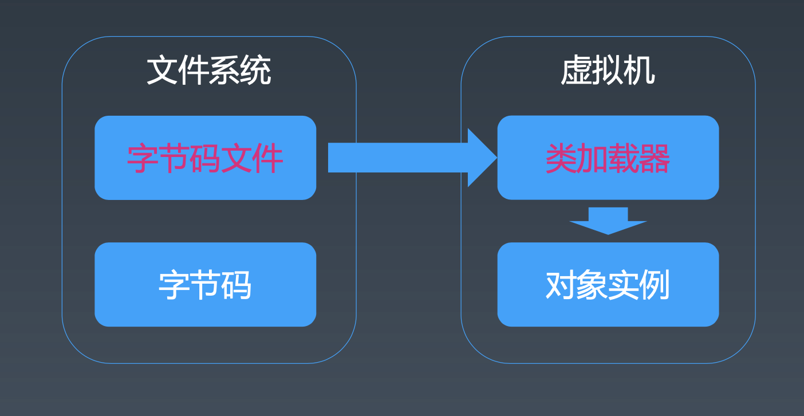

# 学习笔记

## JVM基础知识

编程语言分类角度：
* 高级语言
  * 面向过程、面向对象、面向函数（范式）
  * 静态类型、动态类型
  * 编译执行、解释执行
  * 有虚拟机、无虚拟机
  * 有GC、无GC
* 汇编语言
* 机器语言

编程语言分类和比较：
* [List of programming languages by type](https://en.wikipedia.org/wiki/List_of_programming_languages_by_type)
* [Comparison of programming languages](https://en.wikipedia.org/wiki/Comparison_of_programming_languages)

编程语言跨平台：
* 源代码跨平台：源代码在不同平台编译后运行
* 二进制跨平台：比如Java编译成统一的字节码后分发到不同平台，在不同平台的JVM运行统一个字节码文件

Java是一种面向对象、静态类型、编译执行，有VM/GC和运行时的二进制跨平台高级语言。

字节码、类加载器和虚拟机的关系：

## Java字节码技术

Java bytecode由单字节(byte)的指令组成，理论上最多支持 256个操作码(opcode)。实际上Java只使用了200左右的操作码， 还有一些操作码则保留给调试操作。

[JD-GUI](https://github.com/java-decompiler/jd-gui)
